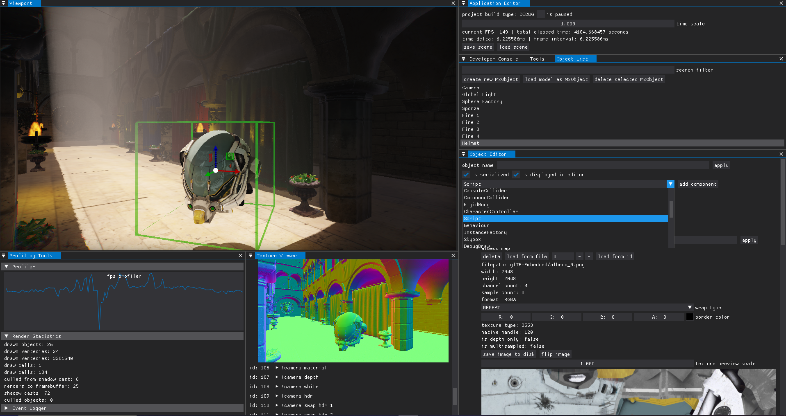
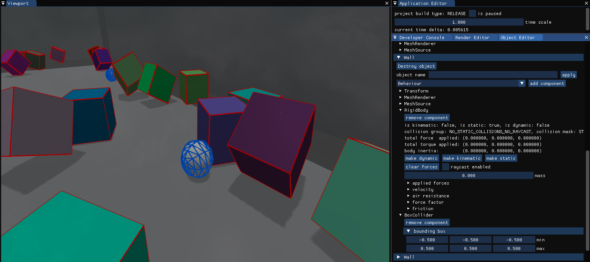
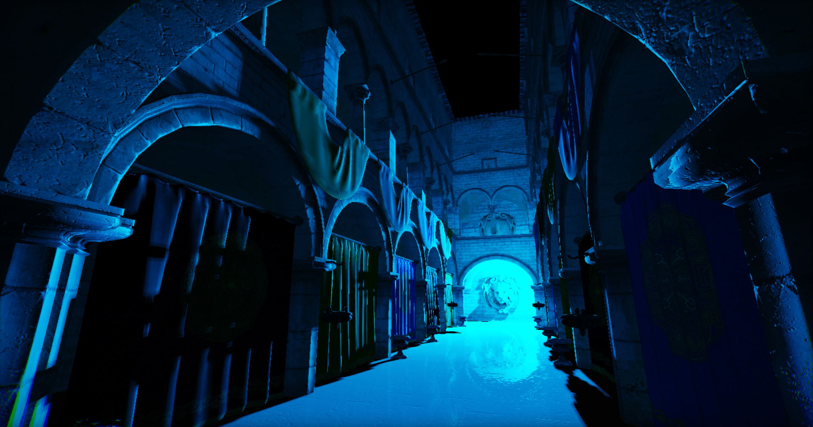
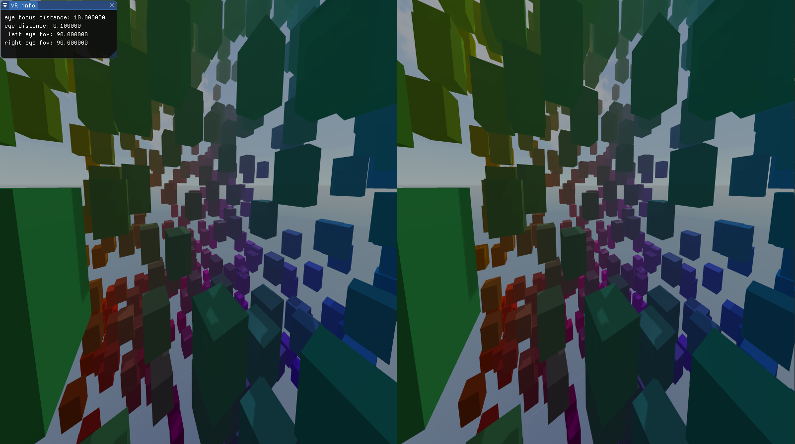
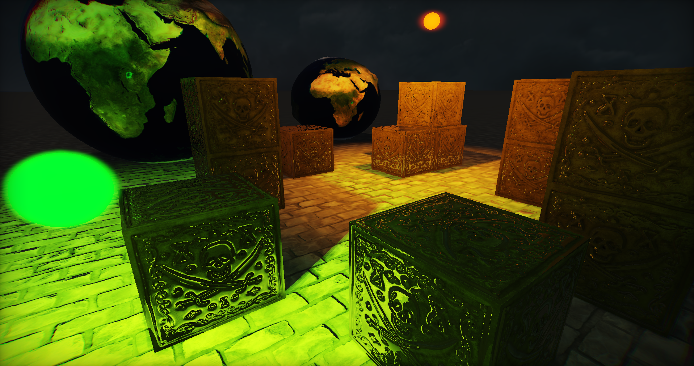

# MxEngine

[](https://travis-ci.org/asc-community/MxEngine)
[](https://ci.appveyor.com/project/MomoDeve/mxengine/branch/master)

[](https://trello.com/b/lfPsihUY/mxengine)
[](https://discord.gg/YWJEX7a)
<!-- soon! [](https://codedocs.xyz/MomoDeve/MxEngine/) -->

MxEngine is an educational modern-C++ general-purpose 3D game engine. 
Right now MxEngine is developed only by me, [#Momo](https://github.com/MomoDeve), but any contributions are welcome and will be reviewed.
Fow now MxEngine supports OpenGL as graphic API and targets x64 only. I develop the project in my free time, so updates may be not so frequent!

***Note:** MxEngine is currently being ported to new Vulkan rendering backend. Development progress of the rendering library can be found here: [VulkanAbstractionLayer](https://github.com/asc-community/VulkanAbstractionLayer)*

<p align="center">

</p>

## Versions & Releases
MxEngine releases come with versions in format X.Y.Z where X stands for major release, Y for minor release and Z for bug fixes or non-significant changes. 

Major releases are prone to breakage of already existing API and functional but bring a lot new features to the engine. Usually it is possible to rewrite all code using new API and retain former behaviour.

Minor releases may change API or add new features but usually user code can be easily adapted to them. With this releases also come some new MxEngine user libraries (for example new bindings or non-required components)

Bug fixes & improvements are just fixes to already existing code to reestablish initially planned behaviour. This fixes may also be merged into major or minor releases if they come in the same time.

For full version list see [versions.md](versions.md) file

## Installing and running MxEngine
#### As a developer (if you want to contribute or check samples)
Right now MxEngine is distributed in source code with configurable CMake files. Here are the steps you need to do to compile and run MxEngine sample projects:
1. clone this repo to your system using `git clone --recurse-submodules https://github.com/asc-community/MxEngine`
2. build project by running `CMakeLists.txt` located in root directory (set up the environment if needed)
3. select one of executables from samples folder and run it to check if everything was built successfully
4. to create your own project, consider taking ProjectTemplate sample as starting point, it has everything already configured for build

#### As a user (if you want to develop your own application)
To develop your own applications using MxEngine you can use template project with already setup dependencies:
[MxEngineTemplate](https://github.com/MomoDeve/MxEngineTemplate) (make sure it contains up-to-date version of the engine)

## Feature list
<details>
	<summary><b>Rendering features</b></summary>

	- Deferred Physically Based Rendering (Cook-Torrance GGX)
	- Screen Space Reflection, Screen Space Ambient Occlusion, Screen Space Global Illumination
	- Cascade shadow maps, omnidirectional shadow maps, spot projection maps
	- directional, point and spot dynamic lights
	- Adaptive tone mapping, FXAA, fog, bloom effect
	- Particle System based on compute shaders
	- 2D debug utilities: light, sound, object bounds, lines, rectangles and etc.

</details>
<details>
	<summary><b>Physics features</b></summary>

	- Rigid body dynamics: static, dynamic and kinematic bodies
	- Collision detection with triggers and callbacks
	- Raycasting with object type filtering

</details>
<details>
	<summary><b>Audio features</b></summary>

	- 3D sounds with distance attenuation
	- Support of popular audio formats: .mp3, .ogg, .wav, .flac

</details>
<details>
	<summary><b>Programmable API</b></summary>

	- Entity Component System (20+ different components)
	- Safe to use handle system (RAII or by managable object pools)
	- 50+ supported objects formats via Assimp library (with automatic normal & tangent generation)
	- Event system with ability to add your own event types
	- Logging, image & cubemap loading, json reading, UUID, random generators and more

</details>
<details>
	<summary><b>Scripting & runtime editing</b></summary>

	- Runtime C++ code compilation via dynamically load libraries
	- Runtime GLSL shader editing (both engines and your own)
	- ImGui editor with multiple draggable windows (docking)
	- Load/save file dialog, texture viewer, mesh, material & component editors
	- One-click scene loading/saving, generic serializer for all components and resources

</details>

## Code snippets
### Primitive creation
You can easily create spheres, planes, cylinders and etc. Custom number of vertecies for displacement maps are supported out of box
```cs
auto cube = MxObject::Create();
cube->AddComponent<MeshSource>(Primitives::CreateCube());
cube->AddComponent<MeshRenderer>();
```
### Loading object from file
MxEngine is using Assimp library which can load any popular object format. To load materials simply pass same path to object file
```cs
auto object = MxObject::Create();
object->AddComponent<MeshSource>(AssetManager::LoadMesh("objects/your_object.obj"));
object->AddComponent<MeshRenderer>(AssetManager::LoadMaterials("objects/your_object.obj"));
```
### Creating lights
Dynamic directional lights, spot lights and point lights are supported. Each has a similar interface and is created in a uniform way
```cs
auto object = MxObject::Create();
auto light = object->AddComponent<SpotLight>();
light->SetColor(Vector3(1.0f, 0.7f, 0.0f));
light->SetIntensity(100.0f);
light->SetAmbientIntensity(0.3f);
light->SetOuterAngle(45.0f);
```
### Using scripts for runtime code compilation
by creating a seperate file with special macro definition you are able to add scripts to objects and
then edit them in runtime - the scripts will be recompiled automatically:
```cs
#include <MxEngine.h>
using namespace MxEngine

class YourScript : public Scriptable
{
public:
    virtual void OnCreate(MxObject& self) override { }
    virtual void OnReload(MxObject& self) override { }
    virtual void OnUpdate(MxObject& self) override { }
};
MXENGINE_RUNTIME_EDITOR(YourScript);
```
```cs
// you can add it as a component by name:
auto object = MxObject::Create();
object->AddComponent<Script>("YourScript");
```
### Creating multiple objects using GPU instancing
you can create MxObjects which share same mesh and material. They all can have different position and color, but still rendered in one draw call
```cs
auto factory = MxObject::GetByName("ObjectFactory");

auto instance1 = Instanciate(factory);
instance1->Transform.SetPosition({0.0f, 1.0f, 0.0f});

auto instance2 = Instanciate(factory);
instance2->Transform.SetPosition({0.0f, 2.0f, 0.0f});

auto instance3 = Instanciate(factory);
instance3->Transform.SetPosition({0.0f, 3.0f, 0.0f});
```
### Playing audio files
To play audio files in 3D world, attach listener to player object and create object with audio source component. mp3, wav, flac and ogg file formats are supported
```cs
auto player = MxObject::Create();
auto listener = player->AddComponent<AudioListener>();

auto object = MxObject::Create();
object->Transform.SetPosition({1.0f, 0.0f, 1.0f});
auto audio = object->AddComponent<AudioSource>(AssetManager::LoadAudio("sounds/music.mp3"));
audio->Play();
```
### Controlling particle systems
The engine supports particle systems which are computed on GPU (up to million particles at 60FPS)
```cs
auto object = MxObject::Create();
auto particles = object->AddComponent<ParticleSystem>();

particles->SetMaxParticleCount(5000);
particles->SetParticleSpeed(10.0f);
particles->SetShape(ParticleSystem::Shape::HEMISPHERE);
```
### Managing multiple cameras
You can create cameras and render scene from different angles. The results can be used for post-effects or dynamic textures
```cs
auto object = MxObject::Create();
auto camera = object->AddComponent<CameraController>();
camera->SetDirection(Vector3(1.0f, 0.0f, 0.0f));
```
### Creating physical objects
MxEngine supports realtime physics simulation. Just add RigidBody component and attach suitable collider
```cs
auto sphere = MxObject::Create();
sphere->AddComponent<MeshSource>(Primitives::CreateSphere());
sphere->AddComponent<MeshRenderer>();
sphere->AddComponent<SphereCollider>();

auto rigidBody = sphere->AddComponent<RigidBody>();
rigidBody->SetMass(1.0f);
rigidBody->SetLinearVelocity({0.0f, 10.0f, 0.0f});
```
### Raycasting on your game scene
All physical objects with colliders can be raycasted and accessed using simple api
```cs
auto raySource = Vector3(0.0f);
auto rayDirection = Vector3(1.0f, 0.0f, 0.0f);
auto rayLength = 100.0f;
auto rayDistance = raySource + rayDirection * rayLength;

float rayFraction = 0.0f;
auto object = Physics::RayCast(raySource, rayDistance, rayFraction);
if(object.IsValid())
{
	MXLOG_INFO("raycast", "found object: " + object->Name);
	MXLOG_INFO("raycast", "distance to object: " + ToMxString(rayLength * rayFraction));
}
```
### Setting up timers and events
You can sign up for event or create timer with specific call interval in one line of code
```cs
Timer::CallEachDelta([]() { MXLOG_INFO("MyTimer", "I am called every 500ms!"); }, 0.5f);

Event::AddEventListener("MyEvent", [](UpdateEvent& e) { MXLOG_INFO("MyEvent", "I am called every frame!"); });
```
### Reading input from user devices
To read input, you can add event listener or just retrieve state in update method. Also, there are binders for player controls
```cs
auto player = MxObject::Create();
auto control = player->AddComponent<InputController>();
control->BindMovement(KeyCode::W, KeyCode::A, KeyCode::S, KeyCode::D);

if (Input::IsMousePressed(MouseButton::LEFT))
	ShootBullet(player);
```
### Integrating your editors into MxEngine runtime editor
If you want custom editors in your application, you can use ImGui functions in update loop
```cs
void OnUpdate() override
{
	if(Runtime::IsEditorActive())
	{
		ImGui::Begin("MySettings");
		ImGui::InputFloat("player health", &health);
		ImGui::InputFloat("player ammo", &ammo);
		ImGui::End();
	}
}
```
### Saving rendered images to disk
Sometimes you want to save rendered image to your hard drive. There are functions to do so
```cs
auto texture = cameraController->GetRenderTexture();
ImageManager::SaveTexture("images/camera.png", texture);

ImageManager::TakeScreenShot("images/viewport.png");
```
### Drawing debug primitives
There are cases when you just want to display some 2D primitives to debug your game or check current object state
```cs
auto debug = object->AddComponent<DebugDraw>();
debug->RenderBoundingBox = true;
debug->BoundingBoxColor = Colors::Create(Colors::RED);

Rendering::Draw(Line({0.0f, 0.0f, 0.0f}, {10.0f, 10.0f, 10.0f}), Colors::Create(Colors::GREEN, 1.0f));
```
### Scene managing
You can save your game objects, resources and scripts into a json script file. They can be loaded later with one function
```cs
// application state and all MxObjects and resources are saved and written to a json file
Scene::Save("scene.json");
// to completely replace current scene with another simply load a json file
Scene::Load("another_scene.json");
```

## Dependencies
If you are interesed in libraries MxEngine depend on, consider reading [dependencies.md](dependencies.md) file. It contains third-party library list with links to each project's github repository and brief explanation of why each library is used in the engine. Note that some of the libraries are shipped in modified version, so do no try to edit engine CMake file if your are unsure if everything will still work correctly

## Answers to some questions:
- Is it possible to build MxEngine under Linux/MacOS/other system?
	
	> MxEngine supports Windows/Linux builds. Unluckly, other systems are not supported out-of-box for now. If you want to help with porting library to other systems, consider reading [PR guideline](https://github.com/asc-community/MxEngine/issues/5).
- Whats the roadmap for the engine? Which features can I expect to see, if I follow this repository?
	
	> I put all features and not-fixed bugs to the public [trello board](https://trello.com/b/lfPsihUY/mxengine). If you want to see some specific feature in engine, which is not mentioned already, you can request it in [feature request](https://github.com/asc-community/MxEngine/issues/4) issue
- Why do you do this project? How long are you planning to develop the engine? Will it one day be better than UE/Unity/Godot?
	
	> Initially this was an educational project (actually I still learn a lot of new things when developing it), where I learned about OpenGL, graphics, software engeneering and game development. I loved it and still love to spend my free time fixing some stuff or implementing new features. Thats really a great opportunity to have such cool project, even if it will never be any better than existing game engines like Unity or Unreal Engine
- If I want to help you with development, how can I get into this project? Is there a documentation for it?
	> Sadly there are too much things that I need to document and so much features which I need to implement, that I have almost no time for proper documentation. You can start with `ProjectTemplate` CMake project, and try some things for yourself. I promise I will add more samples with each release to make usage of the engine easier. If you want to help me with developing, building on other systems or fixing bugs, first contact me personally (links to my social media can be found in [my profile](https://github.com/MomoDeve)). We can discuss what you may do and how can you help the engine to progress
## More engine screenshots
<p align="center">

<i>physics simulation with colliders turned on</i>


<i>Sponza scene with one point light</i>


<i>light and sound bounds, other debug utilities</i>
</p>


<i>shadow casting from dynamic lights, screen-space reflections</i>
</p>

## Special thanks
#### God Ray Effect by [#Fall2019](https://github.com/fall2019)

</p>

## Projects based on MxEngine
Here is the list of some projects using MxEngine. If you want to see yours here, [contact me](https://github.com/MomoDeve).

### PathTracer by MomoDeve
Path tracing in GLSL shaders, project link: https://github.com/MomoDeve/PathTracer
<p align="center">

</p>

### Rainball by WhiteBlackGoose
3D pseudo water simulation, project link: https://github.com/WhiteBlackGoose/Rainball
<p align="center">

</p>
